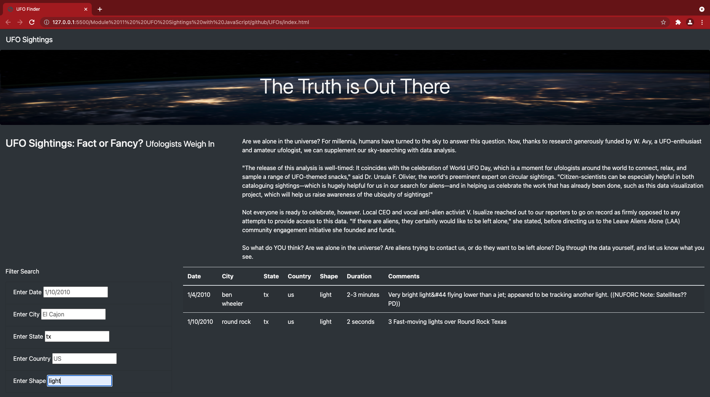

# UFOs

In this project, we help Dana  to create a table to organize UFO data that is stored as a JavaScript

We create a webpage using  our HTML and Bootstrap knowledge to  create filters to make this table fully dynamic

Finally, we customize the webpage using Bootstrap and equip your table with several fully functional filters that will allow users to interact with our visualizations. 

